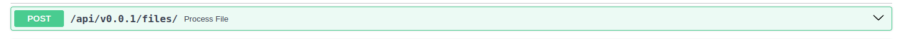
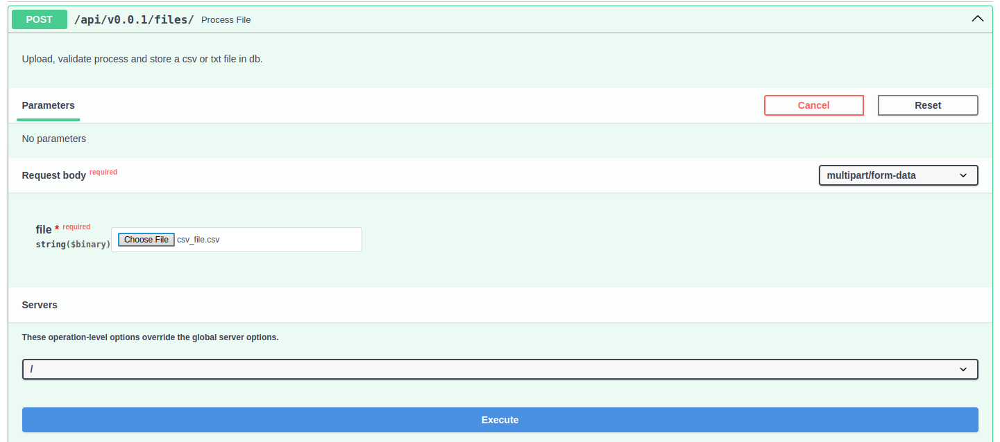
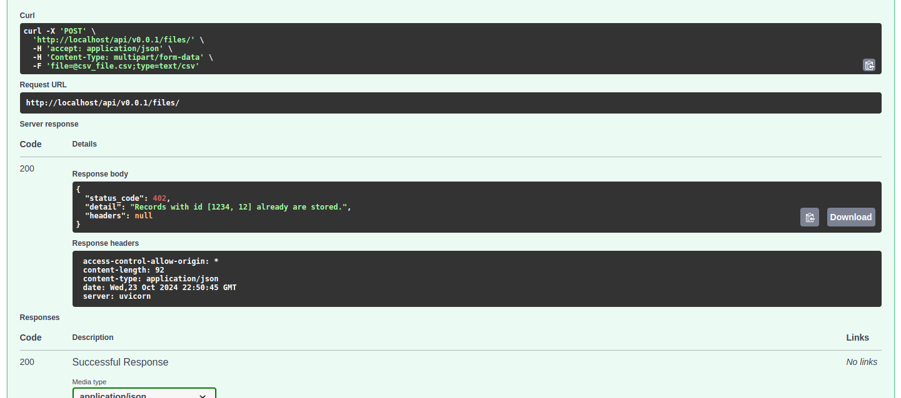
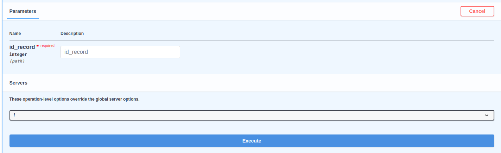
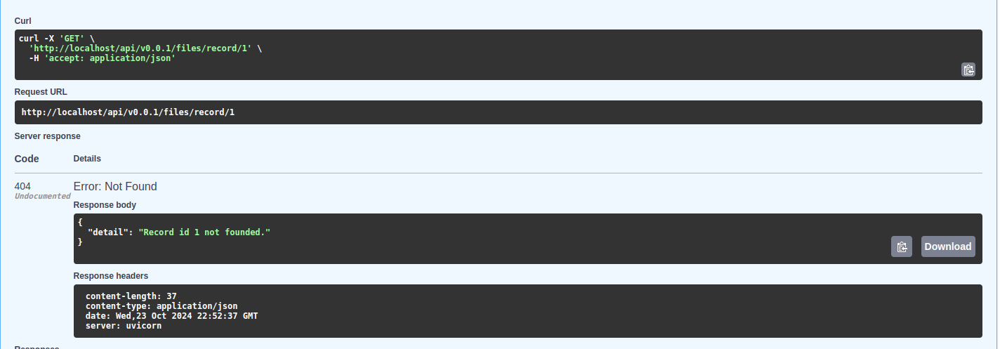

# Python Developer Challenge

The challenge is: "Create a Backend file processor project"

This project involves the development of a backend application in Python that allows for the upload and validation of flat files (.txt or .csv) through an interface. The application processes the data, inserts the records into a database using an ORM (Object-Relational Mapping), and enables querying each record by its ID.

## Pre requisites

- Docker installed on your machine ([Install Docker](https://docs.docker.com/get-docker/))


## Environment Variables

Add and set .env in project root with the vars:


#### Set Database credentials
- `POSTGRES_PORT=5432`
- `POSTGRES_HOST=db`
- `POSTGRES_DB=postgres`
- `POSTGRES_USER=postgres`
- `POSTGRES_PASSWORD=postgres`

#### Set postgresql database uri
- `DATABASE_URL="postgresql://${POSTGRES_USER}:${POSTGRES_PASSWORD}@${POSTGRES_HOST}:${POSTGRES_PORT}/${POSTGRES_DB}?sslmode=disable"`


#### Set docker image name
- `IMAGE_NAME=file_processor`


## Building the Docker containers

Follow the next steps to build the python and db containers:

1. Open a terminal.
2. Navigate to the directory of the project.
3. Run the following command:

    ```bash
    docker compose build --no-cache
    docker compose up
    ```

## Tests

To run test, you can run the following commands:

    ```
    make build
    ```
    
    This command will build from scratch the containers, 
    up them and run test, afterward leave the exec container mode.

Or run the tests once the image and containers are up and running

    ```
    make test
    ```
Now you can consume the api on your localhost via insomnia/postman: http://localhost:80 and url path, or use it in via swagger http://localhost/docs


# How to use 

1. **Access the API Documentation**
   - Go to `http://localhost/docs` to use the API via Swagger. You can use the attached files in the repository or upload your own.

2. **POST Endpoint**
   - **Expand the POST Endpoint**
     
   
   - **Test the Endpoint**
     - Click on "Try it out" to upload the attached file or your own.
     

   - **Execute to See the HTTP Response**
     - Click the "Execute" button to view the HTTP response.
     

3. **GET Endpoint**
   - **Expand the GET Endpoint**
     

   - **Test the Endpoint**
     - Click on "Try it out" and enter an ID from a record or any ID you wish to search in the database.
     

   - **Execute to See the HTTP Response**
     - Click the "Execute" button to view the HTTP response.
     
